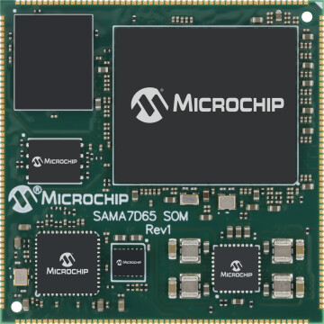

# SAMA7D65 System-On-Modules Series
## Early Access Repository

The Microchip SAMA7D65 System-On-Module Series is a small, single-sided SOM series based on a System-in-Package (SiP) Arm® Cortex®-A7 CPU-based embedded microprocessor running up to 1 GHz.
The SAMA7D65 SOM Series is built on a common set of proven Microchip components to reduce time to market by simplifying hardware design and software development.
The SOM embeds a SAMA7D65 SiP microprocessor with up to 2-Gbit DDR SDRAM, up to 8-Gbit NAND Flash memory, a Gigabit Ethernet PHY, a 64-Mbit serial Quad I/O Flash memory and a dedicated Power Management Unit.
The SAMA7D65 SOM Series also limits the design rules of the main application board, reducing overall PCB complexity and cost. The SAMA7D65 SOM Series is supported by a free Linux® distribution and bare-metal C examples.   

This new SOM series is targeted for production very soon, but in the meantime this Github repository serves as the main resource for documentation and software support for the SAMA7D65 SOM series.  Samples are available today, please contact your local Microchip sales office. 

For more information about the SAMA7D65 CPU, or the associated SIPs referenced above, please visit the respective product page on Microchip.com.
* https://www.microchip.com/en-us/product/SAMA7D65

## Assembly Limitations
It is not recommended to use industrial automated reflow process with oven to solder the product on the mother board, as the process might impact the System-On-Module reliability.

Work Around: Solder the System-On-Module on the mother board manually.

## Collaterals
* Hardware
  * SOM Hardware Design Files can be requested by contacting your local [Microchip Sales or Sales representative](https://www.microchip.com/en-us/about/global-sales-and-distribution)
* Documentation
  * [SAMA7D65 SOM Series Preliminary Data Sheet](Documentation/)
  * [System-On-Module (SOM) Assembly and Storage Guidelines](https://ww1.microchip.com/downloads/aemDocuments/documents/MPU32/ApplicationNotes/ApplicationNotes/System-On-Module-SOM-Assembly-and-Storage-Guidelines-DS00005249.pdf)
  * [System-On-Module (SOM) Pick and Place Guidelines](https://ww1.microchip.com/downloads/aemDocuments/documents/MPU32/ApplicationNotes/ApplicationNotes/System-On-Module-SOM-Pick-and-Place-Guidelines-ds00004878.pdf)
* Tools
  * [SAM-BA Programming Tool](https://github.com/atmelcorp/sam-ba/releases/tag/v3.9)
  

## Caution: NAND flash access errors
Read/Write errors can be observed during NAND flash accesses. 

Workaround:
Configure each pin of the NAND flash data bus in Drive Strength “Type A” mode, as described in the following pseudo-code:
* PIO_MSKR0 = 0x000007F8 (selecting pins D0 to D7, that is PA3 to PA10)
* Temp = PIO_CFGR0
* Temp &= 0x00020000
* Temp |= 0x00010000
* PIO_CFGR0 = Temp (writing DRVSTR=0b01 for all selected pins)
